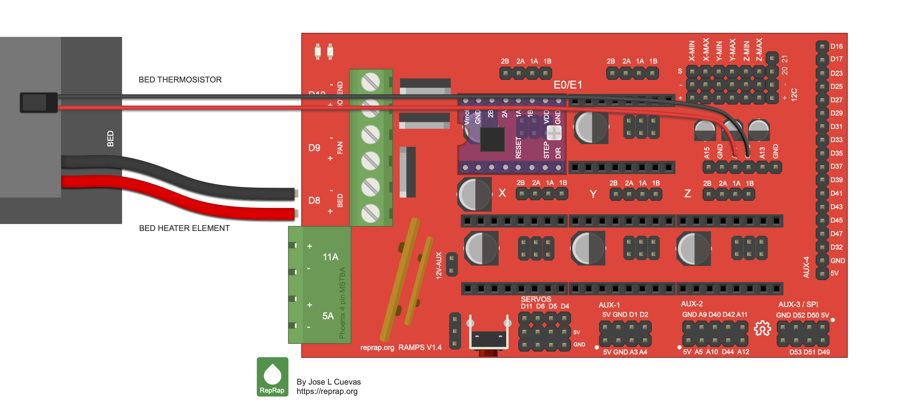
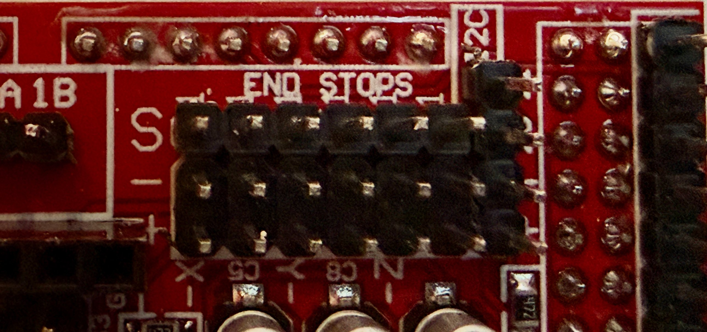

# RAMPS board + UART pigtail — what goes where

> **Revision 2026-10-09.1** · all four drivers on the RAMPS (key in E0); UART pigtail replaces the hub board · log: `docs/revisions.md`

A single bench sheet pulling together everything that gets fitted to the
RAMPS, plus the UART pigtail, so nothing is missed. It restates
`control/wiring.md` (the reference — read it for the *why* and the sources)
and the manual's §2.4, §2.5 and §2.7. The pigtail is drawn in
`control/harness/uart_pigtail.svg`. (Until revision 2026-10-08.2 this sheet
was `ramps_and_hub.md`.)

Dial naming: **A = top-left, B = top-right, C = bottom**, standing in front of
the safe.

**Board map.** The Fasizi board's own silkscreen is sparse; this drawing of
the same layout labels every header. Directions in this sheet are with the
power screw terminals on the left, as drawn.

*RAMPS 1.4 layout, matching Paul's Fasizi board. Illustration by José L.
Cuevas, [RepRap wiki, File:Rampsv14_wiring_bed.png](https://reprap.org/wiki/File:Rampsv14_wiring_bed.png),
used under the [GNU Free Documentation License](https://www.gnu.org/licenses/fdl-1.3.html)
(the wiki's licence for its content). The bed heater and thermistor wiring
drawn in it are not used by this robot.*

**Revision 2026-10-08.1:** the key driver is on the RAMPS now (E0 socket), so
all four drivers are here. There is no remote driver board and no inter-unit
signal cable; the key motor's own cable plugs into the E0 motor header.

**Revision 2026-10-08.2:** the hub board is replaced by the **UART pigtail**,
a six-lead harness with R1 in the TX2 lead and one solder splice (B).

---

## A. On the RAMPS board

### A1. Jumpers under the driver sockets (set the UART address)

Fit these **before** pressing the RAMPS onto the Mega and before plugging the
drivers in.

| Socket | Driver | MS1 | MS2 | MS3 | Address |
|---|---|---|---|---|---|
| X | dial A | — | — | — | 0 |
| Y | dial B | **jumper** | — | — | 1 |
| Z | dial C | — | **jumper** | — | 2 |
| **E0** | **key** | **jumper** | **jumper** | — | **3** |
| E1 | (empty) | — | — | — | — |

- **Never fit an MS3 jumper on any socket.** On the BTT V1.3 the MS3 position
  is the UART line; a jumper there ties UART to 5 V and kills the bus.

### A2. Drivers

- **Four** TMC2209: dial A in **X**, dial B in **Y**, dial C in **Z**, the
  **key in E0**. **Orientation:** the driver's motor-side row (VS, GND, A2,
  A1, B1, B2, VIO, GND) goes in the socket row **nearer that axis's 4-pin
  motor header**; EN … DIR in the other row. Check each socket with the
  multimeter first (manual §2.4 step 1). A reversed driver is destroyed.
- Each of the four has its two EN-end pins **cut flush underneath** (manual
  §2.3). No soldering: the DIAG and UART leads clip onto pins on top.
- Heatsink on each. **VREF pot to minimum** on every driver first.
- **E0 is the top-left socket** (nearer the power terminals), with its
  motor header (2B 2A 1A 1B) at the top edge above it, labelled "E0/E1"
  with E1's. **E1 is the top-right socket: leave it empty.** (KiCad: E0
  socket U5 at the left of the top row, E1 socket U6 to its right; each
  motor header sits above its own socket.) Don't bridge R10 on any driver.
- X, Y, Z are the bottom row, left to right, each with its motor header
  above it.

### A3. Jumper wires landing on the RAMPS headers (F–F, ~10 cm)

**Where the headers are.** Paul's Fasizi board has the layout of the
RepRap wiki's RAMPS 1.4 illustration ([`Rampsv14_wiring_bed.png`](https://reprap.org/wiki/File:Rampsv14_wiring_bed.png),
J. L. Cuevas; Paul, 2026-10-09: "this looks like my board"), and it
agrees with the RAMPS 1.4 KiCad layout (`matt3u/RAMPS-1.4_KiCad` `ea33bdf`).
Directions below are with the **power screw terminals (11A / 5A) on the
left** and the long AUX-4 row on the right. (**Correction**, 2026-10-09: an
earlier version of this sheet said the board has no "END STOPS" text. It
does, above the block, partly hidden by the header plastic; Paul's photo
below.)

- **Endstop block** — top-right corner, under "END STOPS": six 3-pin headers
  side by side, **X-MIN, X-MAX, Y-MIN, Y-MAX, Z-MIN, Z-MAX**, left to right.
  On Paul's board the silkscreen prints **X, Y, Z** under each pair of
  columns and **−** (MIN) / **+** (MAX) above each column, mostly hidden by
  the plastic. The extra column(s) to their right, boxed "I2C", are D20/D21:
  leave them.
- Each header's 3 pins run from the top edge downward, rows labelled at the
  left end of the block: **S** (signal, top row), **−** (GND, middle), **+**
  (5 V, bottom row).
- **AUX-4** — the long single row of 18 pins along the right-hand edge.
  **Pin 1 = 5 V, pin 2 = GND** at its lower end; pin numbers count up
  toward the top edge. **Pin 18 (TX2, D16)** is the top end pin, **pin 17
  (RX2, D17)** the one just below it. The illustration prints the Mega pin
  beside each: **D16** at the top, **D17**, D23, D25, … D32, **GND**, **5V**
  at the bottom. So: TX2 lead on the pin marked D16, RX2 lead on D17.

*Paul's board, 2026-10-09: "END STOPS" above, row labels S / − / + at the
left, X / Y / Z under the column pairs, the I2C column at the right.*

**Check before fitting** (power off, multimeter on continuity) — **done on
Paul's board, 2026-10-09: all three pass.**
1. The **middle** pins of all six endstop headers beep to each other and to
   the "5A" − terminal (GND).
2. The **bottom-row (+)** pins beep to each other (5 V). The **top-row (S)**
   pins beep to nothing else in the block.
3. AUX-4: the pin at the lower end beeps to the endstop 5 V pins (pin 1);
   the next one beeps to GND (pin 2). So pin 18 is the far end.

**No lead goes on a +5 V pin.** Every lead in the table goes on an **S** pin;
the button also uses its header's middle (GND) pin.

**Connector (Paul, 2026-10-09):** one **3-row x 6** female block (three 6-pin
strips glued together) over the whole X_MIN … Z_MAX block. S row, left to
right: DIAG A, DIAG B, **button**, (empty), DIAG C, DIAG key. Middle (GND)
row: the button's GND lead, under Y_MIN. Bottom (5 V) row: empty. All three
rows so it can only sit one way up/down; mark the X_MIN end so it isn't
turned round. The button's leads come up through the deck's wire hole
beside this block (manual §1.4 step 11).

| From | To (RAMPS) | Mega pin |
|---|---|---|
| Dial A driver: top of its **DIAG** pin | **X_MIN**, S pin | D3 |
| Dial B driver: top of its **DIAG** pin | **X_MAX**, S pin | D2 |
| Dial C driver: top of its **DIAG** pin | **Z_MIN**, S pin | D18 |
| **Key (E0) driver: top of its DIAG pin** | **Z_MAX**, S pin | D19 |
| Start/stop button | **Y_MIN**, S and − pins | D14 |
| Pigtail lead **TX2** (the one with R1) | **AUX-4 pin 18** | D16 |
| Pigtail lead **RX2** | **AUX-4 pin 17** | D17 |
| Pigtail lead **A** | top of the **RX** pin, driver in X | PDN_UART, dial A |
| Pigtail lead **B** | top of the **RX** pin, driver in Y | PDN_UART, dial B |
| Pigtail lead **C** | top of the **RX** pin, driver in Z | PDN_UART, dial C |
| Pigtail lead **KEY** | top of the **RX** pin, driver in **E0** | PDN_UART, key |

- **RX** is the driver's 4th pin from EN (EN, MS1, MS2, **RX**, TX, CLK, …),
  standing up through the top. Nothing on TX or CLK. Leave the MS3 *jumper*
  off (A1). Revision 2026-10-08.2: this replaced the RAMPS MS3 jumper pin as
  the tap (checked: a Dupont grips RX; RX–TX open).
- **DIAG** is the EN-end pin next to the trimmer pot ("DIAG" printed under
  it). Nothing on the other EN-end pin.
- The key's **STEP, DIR and EN** are in the E0 socket itself (D26, D28, D24):
  the driver plugging into E0 connects them. No jumper wires for those.
- Power to the RAMPS is **not** a jumper: it's the 20 AWG pair from the
  DC-jack adapter into the screw terminal marked **5A** (A4).

### A4. Power into the RAMPS

- 20 AWG pair from the PSU's **DC-jack-to-screw-terminal adapter** straight
  into the RAMPS terminal marked **5A** (+ and − per silkscreen). RAMPS's own
  5 A fuse feeds all four drivers. Nothing else takes 12 V (the pigtail
  carries only UART signals). Leave the **11A** terminal (heated bed) empty.
- **Leave the Mega's own barrel jack empty.** The drivers get 12 V only through
  the 5A terminal; RAMPS diode D1 feeds the Mega's VIN from there.

### A5. The four motor cables

Each motor plugs into the **4-pin motor header above its own driver socket**,
labelled **2B 2A 1A 1B** (board map at the top of this sheet):

| Motor | Header | Where |
|---|---|---|
| Dial A (top-left) | **X** | bottom row, left |
| Dial B (top-right) | **Y** | bottom row, middle |
| Dial C (bottom) | **Z** | bottom row, right. The Z axis has two headers wired in parallel (for dual-Z printers; RAMPS KiCad Z-MOT1/Z-MOT2 both go to the Z socket): use **either one, not both** |
| Key | **E0** | top edge, the left one of the two marked "E0/E1" (E1, right, stays empty) |

**Coil pairs, not colours, decide the wiring.** Pins **2B–2A** drive one coil
and **1A–1B** the other. STEPPERONLINE's manual for the sister motor
17HS19-2004S1 pairs **black–green** (one coil) and **red–blue** (the other):
"reverse the connection of one of the coil pairs (e.g., swap Black and Green
wires, or swap Red and Blue wires)" (manuals.plus, B00PNEQKC0; Paul,
2026-10-09). So a plug wired Black, Green, Red, Blue already has each coil at
one end. That page is for a different model and some units have the middle
two wires swapped (`CLAUDE.md`, vendor note), so check each motor (12 V off,
motor unplugged).

**Correction (Paul, 2026-10-09/10, bring-up stage 2):** all four motors
buzzed without turning with their plugs as supplied, and all four ran smooth
and quiet once the two middle wires in the housing (blue and green, Paul) were
swapped. All four plugs were wired the same. So the supplied plugs split the
coil pairs, and the sister model's black–green / red–blue pairing doesn't
describe this cable as plugged. After the swap each pair sits at one end of
the plug (positions 1–2 and 3–4). *Which colours pair up: to be confirmed
from the plug's colour order after the swap.* For a replacement motor (the
spare), check before plugging it in:

1. Multimeter on Ω, probes in the plug's sockets: the two wires that read a
   **few ohms** to each other are one coil; the other two read a few ohms too;
   between the pairs, **open**. (No meter: the manual's method — spin the
   shaft by hand, touch two wires together; if it gets noticeably harder to
   turn, they're one coil.)
2. If the two wires of a pair sit **side by side at one end of the plug**
   (positions 1–2 and 3–4), the plug can go on either way round. If a pair is
   split across the middle, swap the two middle wires in the plug housing
   (lift the latch, pull, swap) so each pair is at one end.
3. Plug each cable on the same way for consistency (e.g. **black toward the
   2B end** on all four) and write it down. Turning a plug round reverses
   that motor's direction (it swaps which coil is which; reversing *both*
   pairs' polarity alone would not, as the manual notes). The direction is
   set in the firmware anyway (bring-up stages 4b and 5).

**Send back:** for each motor, the two resistance readings (one per pair),
which colours pair up, and which end of the header the black wire is at.

- The key motor's ~1 m cable is the only wire between the two units. Use it
  as supplied; shorten it only if the key's StallGuard reads too dull in
  bring-up stage 5.
- **Never plug or unplug any motor with 12 V on.**
- A motor that **buzzes or jitters instead of turning** has its coils mixed:
  12 V off and redo step 1 for that one.

### Already on the RAMPS — nothing to add

The 5 A input polyfuse (F1), the diode D1 to VIN, the 100 µF per socket and the
EN pull-ups are all on the board. The parts drawn grey on the schematic are
these.

---

## B. The UART pigtail (`uart_pigtail.svg`) — replaces the hub board

Revision 2026-10-08.2. Six leads, each ending in a female Dupont, soldered
together in one splice. Electrically the same as the hub board it replaces:
the TMC2209 single-wire bus (datasheet Fig. 4.1), TX2 → 1 kΩ → bus; RX2 and
every driver's PDN_UART on the bus. No 12 V, 5 V or GND on it.

**Build:**
1. **Measure**, with the drivers seated: the run from AUX-4 to each driver's
   RX pin (X, Y, Z, E0). Pick a splice point near the middle of the RAMPS.
2. **Make six leads**: cut one end off each of six F–F jumpers (jumper halves
   will do if they're long enough). Each lead keeps its factory-crimped
   female end. Cut each to its measured length + a few cm.
3. **TX2 lead**: solder **R1 (1 kΩ)** in line about 3 cm from its female end;
   heat shrink over it.
4. **Splice**: R1's far lead, RX2, A, B, C and KEY soldered together in one
   joint. Heat shrink over it, then a larger piece over the bundle.
5. **Label** each female end with tape: TX2, RX2, A, B, C, KEY.
6. **Check with the multimeter (Ω), pigtail loose:** TX2 → RX2 about 1 kΩ;
   TX2 → A, B, C, KEY about 1 kΩ each; RX2 → A, B, C, KEY about 0 Ω each. Tug
   each lead at the splice.
7. **Fit** (power off): leads as in A3; zip-tie the splice to the deck so the
   leads can't pull on the joint.

Every driver lead has its own female end: pull it off the RX pin before
unplugging that driver.

---

## C. Order of work (from `bringup.md`)

1. RAMPS jumpers (A1) → RAMPS onto Mega → the four drivers in (A2).
2. Build the UART pigtail (B) and check it with the multimeter.
3. Power wiring: PSU → DC-jack adapter → RAMPS "5A" terminal. Check adapter
   polarity with the multimeter first.
4. Signal jumpers (A3): the four DIAG jumpers, the six pigtail leads, the
   button.
5. The key motor cable into the E0 motor header (A5), 12 V off.
6. Bring-up stage 1: `ping` — all four drivers must answer (A at address 0 …
   key at address 3) before anything moves.
